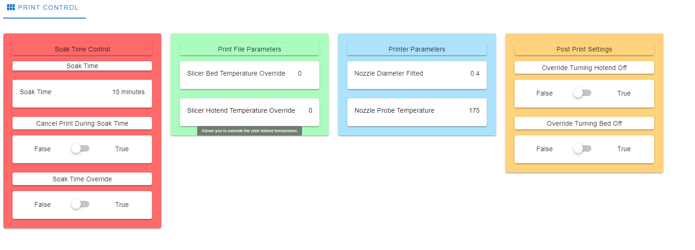

# BtnCmd

As part of version 1.3, a custom BtnCmd screen has been created to allow some aspects of a print to be adjusted.
  
This screen allows for the following items to be changed or overriden.

## Installing BtnCmd

More information about the plugin, as well as a manual, can be found [here](https://github.com/MintyTrebor/BtnCmd)  
Instructions for installing a plugin can be found [here](https://github.com/MintyTrebor/BtnCmd/wiki/Installation)

## Importing the page

Download the BtnCmdforTroodonV2.json file from this folder.  
Click on the show settings button.  
  
Click on the backup/restore button.  
  
Click on the import button.  
  
Follow the popup instructions, uploading the BtnCmdforTroodonV2.json file you downloaded

## Create a backup that auto restores

Click on the backup/restore button.  
  
Click on the backup button.  
  
Navigate to the system folder using the left hand bar in DWC.  
Rename "BtnCmdSettings.json" to "BtnCmdAutoRestore.json"  

# Screen Breakdown

## Soak Time

This sets the time (in seconds) for the printer to soak for before a print is started. The default is 900 and is set in /sys/globals.g

## Cancel Print During Soak Time

Allows you to cancel a print during the soak time.

## Soak Time Override

This overrides whether the soak time is applied during a print. False = it is not overriden, True = it is overriden and the print is started without being soaked. It also allows you to cancel the soak time whilst the printer is soaking.

## Slicer Bed Temperature Override

This allows you to override the bed temperature set by the slicer.  
If the value is set to 0, then the slicer temperature is used. If any other value is used, that is used instead. This allows for the sliced file temperature to be changed without editing or reslicing the file. 

## Slicer Hotend Temperature Override

This allows you to override the hotend temperature set by the slicer.  
If the value is set to 0, then the slicer temperature is used. If any other value is used, that is used instead. This allows for the sliced file temperature to be changed without editing or reslicing the file.  

## Nozzle Diameter

At the start of a print, the firmware checks whether the nozzle diameter in the gcode matches the nozzle diameter in the gcode.

## Nozzle Probe Temperature

This is the temperature that is used for activities such as the probe offset and autoz offset.

## Override Turning Bed Off

This is useful if you are carrying out multiple concurrent prints as it keeps the bed on at the end of a print. This is works well in conjunction with soak time override for follow on prints.

## Override Turning Hotend Off

This is useful if you are carrying out multiple concurrent prints and want the hotend to remain on after the print.  

