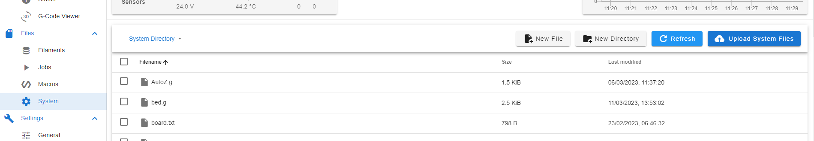
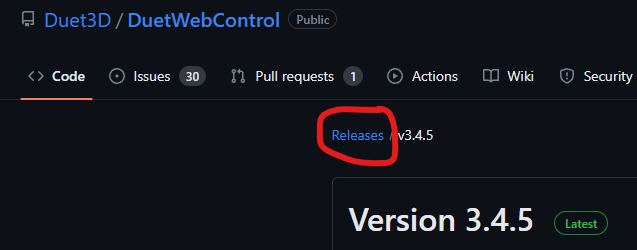

# Troodon-V2 Updated Config

This set of config files assumes that the firmware has been updated to at least 3.4.5.

**WARNING** When using this config, please delete the 2 G31 lines out of your config-override.g and recalibrate your AutoZ and Toolhead Probes

# Changelog

# Version 1.5.1

* Nozzle-clean.g add a bit more wait code for temperature
* start_print.g added Nozzle-clean.g and AutoZ.g
* AutoZ.g updated to use global.nozzleProbeTemperature
* cura profile added readme for start and end codes
* Added zip to make it easy to initially upload the new config
* rename "（1）Probe trigger height.g" to "1 - Probe trigger height.g"
* rename "（2）Autoz trigger height.g" to "2 - Autoz trigger height.g"

# Version 1.5

* config.g added firmware retraction, increased PA from 0.02 to 0.045, reduced default steps/per mm for extruder to 417
* Renamed some folders to remove spaces
* Added Cura Slicer Profile
* Added some STL files

# Version 1.4

* AutoZ.g updated to use global.nozzleProbeTemperature and to allow the macro to be called if heating of the nozzle has already happened
* Globals.g added global.nozzleProbeTemperature and global.Cancelled. Changed soakTime from 900 to 15 as its now in minutes
* Nozzle-clean.g updated to use global.nozzleProbeTemperature and to allow the macro to be called if heating of the nozzle has already happened
* BtnCmd Import file updated to fix colours in dark mode and add global.nozzleProbeTemperature
* screen.g remove redundant X2
* start_print.g changed method of soak delay (Thanks @OwenD from forum.duet3d.com), added way of cancelling print.
* added start_after_delay.g
* stop.g add temp check before retract
* daemon.g fix homing check
* bed.g add turn off mesh levelling and clear babystepping
* homex.g and homey.g updated to check endstop status etc before movement
* added start.g with filament check
* (1)Probe trigger height.g macro - updated to use global.nozzleProbeTemperature
* (2)Autoz trigger height.g macro - updated to use global.nozzleProbeTemperature
* save_babystep.g macro added

# Version 1.3.1

* fix variable in stop.g

## Version 1.3

* All firmware files moved into a folder called Config
* config.g Chamber Fan frequency changed from 500 to 40
* config.g Added call to globals.g
* Added globals.g
* Added start_print.g this is used by the slicer profiles to pass parameters through to the firmware.
* Added stop.g which is called at the end of the print.
* Use of BtnCmd to control print parameters. Please see the readme in the BtnCmd folder for instructions.
* Added Prusa Slicer Profile
* removed DWC files
* added 25% and 75% air filtration macros

## Version 1.2

* Add filaments folder
* change screen.g to use bitbanged neopixels and swap the flashing to the button rather than the screen

## Version 1.1.2

* Typo in screen.g

## Version 1.1.1

* Fix typo in pause.g

## Version 1.1

* Add daemon.g file to control electronics bay fan depending on whether X/Y/Z are energised

## Version 1

* The coordinate system has been flipped so 0,0 is now in the front left rather than the back right. All files that use coordinates have been updated accordingly
* AutoZ.g has been updated to set the nozzle temperature to 175 degrees before probing in case of plastic on the nozzle
* Bed.g uses different dive height settings to speed up probing after first pass
* board.txt updated to use the built in pin definitions for the troodon v2
* config.g updated to use pin names rather than pin numbers
* config.g M572 moved to after the extruder is created
* config.g jerk speed and motor currents lowered
* config.g dual probing speeds set for toolhead probe
* config.g Q10 added for bed SSR
* config.g MCU temp added as a sensor
* config.g lights and electronics fan not set to start on boot
* config.g 12864 settings moved to screen.g
* config.g T0 added to end of config
* homeall.g set to use individual homing files
* homex.g and homey.g second pass homing speed reduced
* homez.g now moves to centre of bed to home
* nozzle-clean.g heats up hotend before cleaning
* pause.g retraction increased from 0.5 to 2mm and tool moves to front centre of the machine
* resume.g priming of nozzle increased from 0.5 to 2mm

# Initial Upgrade Instructions

Upload the latest stable version of reprapfirmware from [here](https://github.com/gloomyandy/RepRapFirmware/releases/latest/) selecting the asset with firmware-stm32f4-wifi in the name.  
Click on the System tab and then the Upload System Files button.  
  
Find the firmware file you downloaded, select it and then click open.  
When asked, apply the update.  
Upload the latest stable version of DuetWebControl from [here](https://github.com/Duet3D/DuetWebControl/releases/latest/) selecting the asset called DuetWebControl-SD.zip. Make sure that the version number is the same as the firmware file you downloaded above. If it isn't, click on releases and find the correct version.
 
Like above, click on the System tab and then the Upload System Files button, find the DuetWebControl-SD.zip file and click open. DWC (DuetWebControl) will automatically unzip the files and refresh the page when complete.  
Download the config zip file from [here](https://github.com/TeamGloomy/Troodon-V2/releases/latest/).  
Like above, click on the System tab and then the Upload System Files button, find the downloaded config zip file and click open. DWC (DuetWebControl) will automatically unzip the files. When asked, restart the machine.  

# Updating an already converted machine

Either upload the latest release zip file (be aware that this will overwrite any of the files included in the base config) or manually make the adjustments as detailed in each commit.